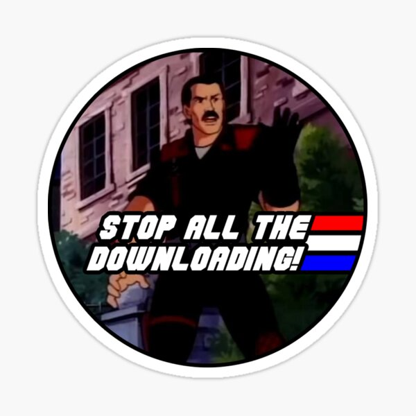

## DJ Downloader

Allows pasting youtube URLs into a Terminal running this tool, which then downloads the mp3 audio for the URL in question and stores it in the config-specified directory.

# Dependencies

 - [Homebrew](https://brew.sh/)
 - [yt-dlp](https://github.com/yt-dlp/yt-dlp) (will attempt to install via homebrew if not found)
 - [ffmpeg](https://ffmpeg.org/) (will attempt to install via homebrew if not found)

## Installation

From a `Terminal.app` command-line run:

```
git clone https://github.com/rick/dj-downloader
cd dj-downloader
script/bootstrap
script/setup
```

Then edit the `config.yml` file to set the path for the folder where mp3 files should be output, and the path to `yt-dlp` (e.g., the output of `which yt-dlp`)

## Running

From the same checkout path just:

```
./run
```


## but why?

Because I have a DJ console from 2012 era that's really cool and kids want to DJ, but they don't have a collection of tracks and just want to beat mix and loop kid stuff they find on youtube. So, "hey, just copy that link and drop it in here, and then when it stops spitting words hit `Refresh` on the DJ collection here..."



